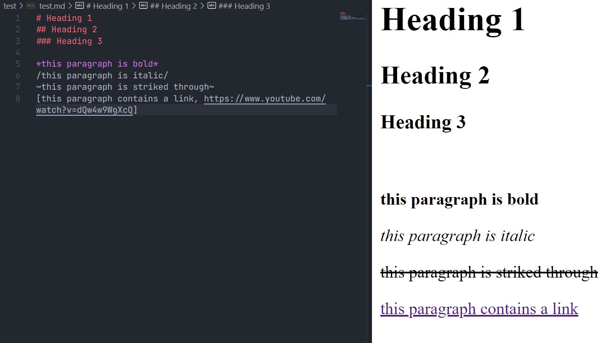

# waterdown 💧


A flavor of Markdown interpreted with Python

Status: experimental
(Does only support one ornament [bold, italic, strike, link] per paragraph as of right now)



## syntax ✍️
```
h1 - # text

h2 - ## text

h3 - ### text

bold - *text*

italic - /text/

strike - ~text~

link [text, link]

image {link, widthxheight}

paragraph - text

unordered list - - text

ordered list - -- text
```

# usage 🔨

Open up a simple Markdown file and write away with the syntax given above.

To interprate waterdown sytax into html, you will need the waterdown.py file as well as an html boilerplate where there is a body tag. The script, after execution will interpret the waterdown and create a copy of the boilerplate with the translation included as tags with the text inside.

The file name which the script is looking for and how the result is called can be changed inside the script which will be made more user friendly in the future

# features 📝

* [x] interpreting standard syntax to html
* [ ] multiple ornaments per line
* [ ] friendlier user interaction
  * [x] minimal CLI
  * [ ] app
* [ ] more syntax
  * [x] pictures
  * [ ] code blocks
  * [ ] instant latex
  * [x] lists
  * [ ] quotes
